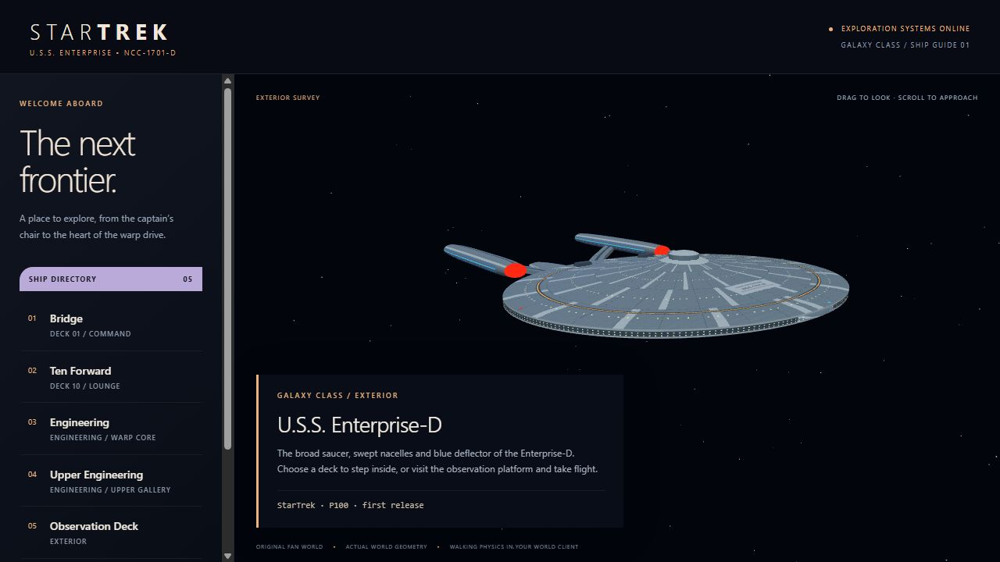
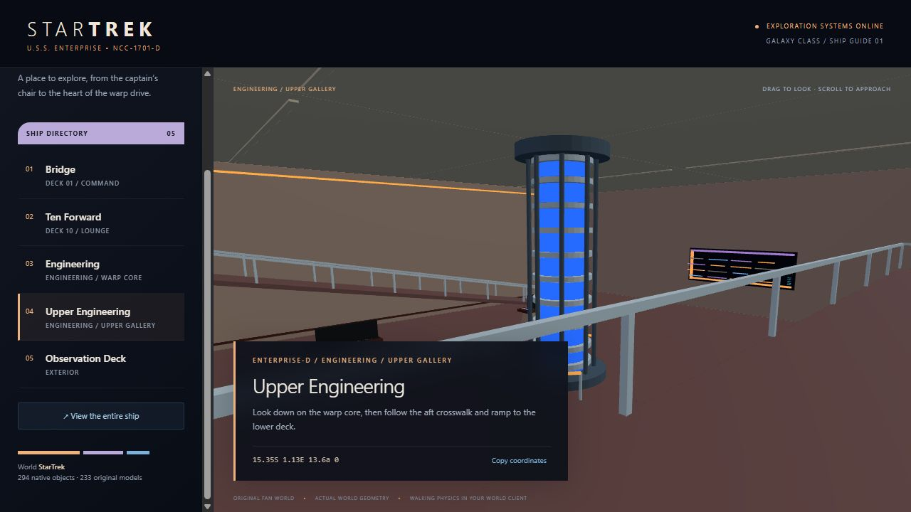

# StarTrek — U.S.S. Enterprise-D

An explorable Enterprise-D-inspired fan world for Axis / Active Worlds, built from original procedural geometry. Fly around the saucer and nacelles, step onto the bridge, relax in Ten Forward, or walk beside the illuminated warp core and climb to engineering's upper gallery.

**P100 · 2 × 2 km · 294 objects · 233 models · 3 avatars · 5 destinations**



Ship-guide screenshot using the generated geometry. Browser lighting is illustrative; native rendering and physics may differ.

The first release includes a complete exterior silhouette and three major interiors: bridge, Ten Forward and two-level engineering. It does not recreate every deck. The ship is approximately 642 metres long and 464 metres wide. The observation platform offers an exterior view, and flight is enabled.

Twenty clickable destination panels provide native sign teleports between the rooms, upper gallery and observation platform. Engineering also has a continuous 18.75% walking ramp. Terrain and water are disabled; an invisible, noncolliding ground helper enables normal walking on the actual room floors. Three original crew avatars represent command, operations and science. They are static meshes without animation sequences. Consoles, seats and the warp core are scenery, and turbolifts use teleports rather than moving cabins.

## Explore the ship guide

From the repository root, use Python 3.11 or newer:

```sh
python -m http.server 8000 --bind 127.0.0.1
```

Open [the local ship guide](http://127.0.0.1:8000/preview/). The ready scene, object path and viewer library are included. Choose a deck to look inside or orbit the exterior. Coordinates shown in the guide use native world units. The loopback URL is for the machine running the preview; other clients need a reachable asset-server URL.

## Rebuild and validate

```sh
python -m pip install -r requirements.txt
python pipeline/generate_startrek.py
python validation/validate_startrek.py
python tools/prepare_preview.py --with-objectpath-preview
```

The generator creates ignored `generated/` output: the portable property-import database, settings, models, avatars, textures, scene and manifest. It never contacts a universe or world server. The preparation tool refreshes the included client assets and guide, including an ignored `objectpath/preview/` copy suitable for asset hosting.

The portable build uses Pillow's bundled font for registry lettering instead of the original installation's system font; ship geometry and placement are preserved.

For deployment, supply the URL that visiting clients can reach:

```sh
python pipeline/generate_startrek.py --output generated-deploy --object-path https://assets.example.org/startrek/
python validation/validate_startrek.py --source generated-deploy
python tools/prepare_preview.py --generated generated-deploy --with-objectpath-preview
```

The default URL is `http://127.0.0.1:8000/objectpath/` for local testing. The chosen URL is applied to both world settings and the ship-guide sign. Generation requires a fresh or empty output directory; choose a new `--output` location for subsequent revisions. See [native compatibility and deployment](docs/NATIVE-COMPATIBILITY.md) before importing into another server. Generated property ownership and restricted editing rights use citizen 1; deliberately map them to an existing destination citizen if necessary. This repository does not create or reset accounts.

## What's included

| Path | Contents |
| --- | --- |
| `pipeline/` | Original hull/interior generators and native property/RWX exporter |
| `validation/validate_startrek.py` | Independent native geometry, asset and route checks |
| `objectpath/models/` | Client-ready RWX models and ZIP packages |
| `objectpath/avatars/` | Version-3 catalog and three static crew avatars |
| `objectpath/textures/` | Original hull-panel and registry textures |
| `preview/` | Interactive ship guide and locally vendored Three.js |
| `docs/` | Design references, compatibility notes and screenshots |

This portable content release excludes live server databases, accounts, credentials, universe registrations, local provisioning tools, installation configuration, operational logs and backups. Generate the property-import database locally; it is not a server-managed world database.

## Validation scope

The independent validator checks native RWX/ZIP geometry, indices, units, textures, ownership, sign faces and UVs, avatar catalogs, world bounds and teleport coordinates. It tests arrival, route, floor and headroom samples against actual transformed collision triangles, including the engineering ramp and upper gallery.

The release includes a correction for mirrored destination labels reported in the native client. Both the turbolift panel and ship-guide sign now map text left to right on their visible faces. Existing installations must refresh cached copies of `st_lift_button.zip` and `st_directory.zip` after replacing these assets. Property positions and teleport actions are unchanged; native-client confirmation of the corrected appearance remains pending.

The initial local deployment acknowledged and independently read back all 294 objects, matched 63 authored settings, accepted caretaker and ordinary visitor-protocol entry, and preserved the previous worlds and accounts. These are historical checks, not acceptance of another server. Native-client visual appearance, sign clicks, avatar appearance and walking physics still need a client walkthrough. The browser guide was visually reviewed at the exterior, bridge, lounge and engineering views.



This is an unofficial fan project. Geometry and textures were authored for this world; no extracted film/game models or production stills are included. See [third-party notices](THIRD-PARTY-NOTICES.md) for attribution and the viewer library license. No overall license for the original project content has been selected.
